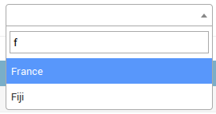
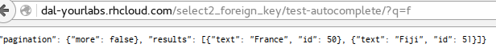
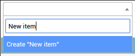
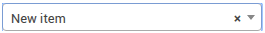
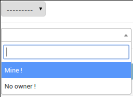
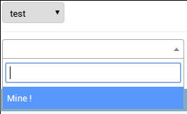

django-autocomplete-light tutorial
~~~~~~~~~~~~~~~~~~~~~~~~~~~~~~~~~~

Overview
========

Autocompletes are based on 3 moving parts:

- widget compatible with the model field, does the initial rendering,
- javascript widget initialization code, to trigger the autocomplete,
- and a view used by the widget script to get results from.

.. _queryset-view:

Create an autocomplete view
===========================

- Example source code: `test_project/select2_foreign_key
  <https://github.com/yourlabs/django-autocomplete-light/blob/master/test_project/select2_foreign_key/urls.py>`_
- Live demo: `/select2_foreign_key/test-autocomplete/?q=test
  <http://dal-yourlabs.rhcloud.com/select2_foreign_key/test-autocomplete/?q=test>`_

The only purpose of the autocomplete view is to serve relevant suggestions for
the widget to propose to the user. DAL leverages Django's `class based views
<https://docs.djangoproject.com/es/1.9/topics/class-based-views/>`_
and `Mixins <https://en.wikipedia.org/wiki/Mixin>`_ to for code reuse.

.. note:: Do **not** miss the `Classy Class-Based Views
          <http://ccbv.co.uk/>`_ website which helps a lot to work with
          class-based views in general.

In this tutorial, we'll first learn to make autocompletes backed by a
:django:term:`QuerySet`. Suppose we have a Country
:django:term:`Model` which we want to provide a `Select2
<https://select2.github.io/>`_ autocomplete widget for in a form. If a
users types an "f" it would propose "Fiji", "Finland" and "France", to
authenticated users only:

The base view for this is :py:class:`~dal_select2.views.Select2QuerySetView`.

.. code-block:: python

    from dal import autocomplete

    from your_countries_app.models import Country

    class CountryAutocomplete(autocomplete.Select2QuerySetView):
        def get_queryset(self):
            # Don't forget to filter out results depending on the visitor !
            if not self.request.user.is_authenticated():
                return Country.objects.none()

            qs = Country.objects.all()

            if self.q:
                qs = qs.filter(name__istartswith=self.q)

            return qs

.. note:: For more complex filtering, refer to official documentation for
          the :django:label:`queryset-api`.

.. _register-view:

Register the autocomplete view
==============================

Create a :django:label:`named url<naming-url-patterns>` for the view, ie:

.. code-block:: python

    from your_countries_app.views import CountryAutocomplete

    urlpatterns = [
        url(
            r'^country-autocomplete/$',
            CountryAutocomplete.as_view(),
            name='country-autocomplete',
        ),
    ]

Ensure that the url can be reversed, ie::

    ./manage.py shell
    In [1]: from django.urls import reverse
    In [2]: #older django versions: from django.core.urlresolvers import reverse

    In [3]: reverse('country-autocomplete')
    Out[2]: u'/country-autocomplete/'

.. danger:: As you might have noticed, we have just exposed data through a
            public URL. Please don't forget to do proper permission checks in
            get_queryset.

Use the view in a Form widget
=============================

You should be able to open the view at this point:

We can now use the autocomplete view our Person form, for its ``birth_country``
field that's a ``ForeignKey``. So, we're going to :django:label:`override the
default ModelForm fields<modelforms-overriding-default-fields>`, to use a
widget to select a Model with Select2, in our case by passing the name of the
url we have just registered to :py:class:`~dal_select2.widgets.ModelSelect2`.

One way to do it is by overriding the form field, ie:

.. code-block:: python

    from dal import autocomplete

    from django import forms

    class PersonForm(forms.ModelForm):
        birth_country = forms.ModelChoiceField(
            queryset=Country.objects.all(),
            widget=autocomplete.ModelSelect2(url='country-autocomplete')
        )

        class Meta:
            model = Person
            fields = ('__all__')

Another way to do this is directly in the ``Form.Meta.widgets`` dict, if
overriding the field is not needed:

.. code-block:: python

    from dal import autocomplete

    from django import forms

    class PersonForm(forms.ModelForm):
        class Meta:
            model = Person
            fields = ('__all__')
            widgets = {
                'birth_country': autocomplete.ModelSelect2(url='country-autocomplete')
            }

If we need the country autocomplete view for a widget used for a ManyToMany
relation instead of a ForeignKey, with a model like that:

.. code-block:: python

    class Person(models.Model):
        visited_countries = models.ManyToManyField('your_countries_app.country')

Then we would use the :py:class:`~dal_select2.widgets.ModelSelect2Multiple`
widget, ie.:

.. code-block:: python

    widgets = {
        'visited_countries': autocomplete.ModelSelect2Multiple(url='country-autocomplete')
    }

Passing options to select2
==========================

`Select2
<https://select2.github.io/>`_ supports a bunch of `options
<https://select2.github.io/options.html>`_. These options may be
`set in data-* attributes
<https://select2.github.io/options.html#data-attributes>`_. For example:

.. code-block:: python

    # Instanciate a widget with a bunch of options for select2:
    autocomplete.ModelSelect2(
        url='select2_fk',
        attrs={
            # Set some placeholder
            'data-placeholder': 'Autocomplete ...',
            # Only trigger autocompletion after 3 characters have been typed
            'data-minimum-input-length': 3,
        },
    )

.. note:: Setting a placeholder will result in generation of an an empty
          ``option`` tag, which select2 requires.

Using autocompletes in the admin
================================

We can make ModelAdmin to :django:label:`use our
form<admin-custom-validation>`, ie:

.. code-block:: python

    from django.contrib import admin

    from your_person_app.models import Person
    from your_person_app.forms import PersonForm

    class PersonAdmin(admin.ModelAdmin):
        form = PersonForm
    admin.site.register(Person, PersonAdmin)

Note that this also works with inlines, ie:

.. code-block:: python

    class PersonInline(admin.TabularInline):
        model = Person
        form = PersonForm

Using autocompletes outside the admin
=====================================

- Example source code: `test_project/select2_outside_admin
  <https://github.com/yourlabs/django-autocomplete-light/tree/master/test_project/select2_outside_admin>`_,
- Live demo: `/select2_outside_admin/
  <http://dal-yourlabs.rhcloud.com/select2_outside_admin/>`_.

Ensure that jquery is loaded before ``{{ form.media }}``:

.. literalinclude:: ../test_project/select2_outside_admin/templates/select2_outside_admin.html

Displaying results using custom HTML
====================================

You can display custom HTML code for results by setting the ``data-html``
attribute on your widget and overriding the view ``get_result_label()`` method
to return HTML code.

.. code-block:: python

    from django.utils.html import format_html

    class CountryAutocomplete(autocomplete.Select2QuerySetView):
        def get_result_label(self, item):
            return format_html(' {}', item.name, item.name)

    class PersonForm(forms.ModelForm):
        class Meta:
            widgets = {
                'birth_country': autocomplete.ModelSelect2(
                    url='country-autocomplete',
                    attrs={'data-html': True}
                )
            }

.. note:: Take care to escape anything you put in HTML code to avoid XSS attacks
          when displaying data that may have been input by a user! `format_html` helps.

Displaying selected result differently than in list
===================================================

You can display selected result in different way than results in list by overriding
the view ``get_selected_result_label()`` method.

.. code-block:: python

    class CountryAutocomplete(autocomplete.Select2QuerySetView):
        def get_result_label(self, item):
            return item.full_name

        def get_selected_result_label(self, item):
            return item.short_name

Setting the ``data-html`` attribute affects both selected result and results in list.
If you want to enable HTML separately set ``data-selected-html`` or ``data-result-html``
attribute respectively.

Overriding javascript code
==========================

We need javascript initialization for the widget both when:

- the page is loaded,
- a widget is dynamically added, ie. with formsets.

This is handled by ``autocomplete.init.js``, which is going to trigger an event
called ``autocompleteLightInitialize`` on any HTML element with attribute
``data-autocomplete-light-function`` both on page load and DOM node insertion.
It also keeps track of initialized elements to prevent double-initialization.

Take ``dal_select2`` for example, it is initialized by
``dal_select2/static/autocomplete_light/select2.js`` as such:

.. code-block:: javascript

    $(document).on('autocompleteLightInitialize', '[data-autocomplete-light-function=select2]', function() {
        // do select2 configuration on $(this)
    })

This example defines a callback that does ``// do select2 configuration on
$(this)`` when the ``autocompleteLightInitialize`` event is triggered on any
element with an attribute ``data-autocomplete-light-function`` of value
``select2``. Select2 Widgets have an :py:attr:`autocomplete_function` of value
``select2``, and that's rendered as the value of the
``data-autocomplete-light-function`` attribute.

So, you can replace the default callback by doing two things:

- change the Widget's ``autocomplete_function`` attribute,
- add a callback for the ``autocompleteLightInitialize`` event for that
  function,

Example widget:

.. code-block:: python

    class YourWidget(ModelSelect2):
        autocomplete_function = 'your-autocomplete-function'

Example script:

.. code-block:: javascript

    $(document).on(
        'autocompleteLightInitialize',
        '[data-autocomplete-light-function=your-autocomplete-function]',
    function() {
        // do your own script setup here
    })

Creation of new choices in the autocomplete form
================================================

- Example source code: `test_project/select2_one_to_one
  <https://github.com/yourlabs/django-autocomplete-light/blob/master/test_project/select2_one_to_one/urls.py>`_,
- Live demo: `/admin/select2_one_to_one/testmodel/add/
  <http://dal-yourlabs.rhcloud.com/admin/select2_one_to_one/testmodel/add/>`_,

The view may provide an extra option when it can't find any result matching the
user input. That option would have the label ``Create "query"``, where
``query`` is the content of the input and corresponds to what the user typed
in. As such:

This allows the user to create objects on the fly from within the AJAX
widget. When the user selects that option, the autocomplete script will make a
POST request to the view. It should create the object and return the pk, so the
item will then be added just as if it already had a PK:

To enable this, first the view must know how to create an object given only
``self.q``, which is the variable containing the user input in the view. Set
the ``create_field`` view option to enable creation of new objects from within
the autocomplete user interface, ie:

.. code-block:: python

    urlpatterns = [
        url(
            r'^country-autocomplete/$',
            CountryAutocomplete.as_view(create_field='name'),
            name='country-autocomplete',
        ),
    ]

This way, the option 'Create "Tibet"' will be available if a user inputs
"Tibet" for example. When the user clicks it, it will make the post request to
the view which will do ``Country.objects.create(name='Tibet')``. It will be
included in the server response so that the script can add it to the widget.

Note that creating objects is allowed to logged-in users with ``add`` permission
on the resource. If you want to grant ``add`` permission to a user, you have to
explicitly set it with something like:

.. code-block:: python

    permission = Permission.objects.get(name='Can add your-model-name')
    user.user_permissions.add(permission)

Filtering results based on the value of other fields in the form
================================================================

- Example source code: `test_project/linked_data
  <https://github.com/yourlabs/django-autocomplete-light/tree/master/test_project/linked_data>`_.
- Live demo: `Admin / Linked Data / Add
  <http://dal-yourlabs.rhcloud.com/admin/linked_data/testmodel/add/>`_.

In the live demo, create a TestModel with ``owner=None``, and another with
``owner=test`` (test being the user you log in with). Then, in in a new form,
you'll see both options if you leave the owner select empty:

But if you select ``test`` as an owner, and open the autocomplete again, you'll
only see the option with ``owner=test``:

Let's say we want to add a "Continent" choice field in the form, and filter the
countries based on the value on this field. We then need the widget to pass the
value of the continent field to the view when it fetches data. We can use the
``forward`` widget argument to do this:

.. code-block:: python

    class PersonForm(forms.ModelForm):
        continent = forms.ChoiceField(choices=CONTINENT_CHOICES)

        class Meta:
            model = Person
            fields = ('__all__')
            widgets = {
                'birth_country': autocomplete.ModelSelect2(url='country-autocomplete',
                                                           forward=['continent'])
            }

DAL's Select2 configuration script will get the value fo the form field named
``'continent'`` and add it to the autocomplete HTTP query. This will pass the
value for the "continent" form field in the AJAX request, and we can then
filter as such in the view:

.. code-block:: python

    class CountryAutocomplete(autocomplete.Select2QuerySetView):
        def get_queryset(self):
            if not self.request.user.is_authenticated():
                return Country.objects.none()

            qs = Country.objects.all()

            continent = self.forwarded.get('continent', None)

            if continent:
                qs = qs.filter(continent=continent)

            if self.q:
                qs = qs.filter(name__istartswith=self.q)

            return qs

Types of forwarded values
~~~~~~~~~~~~~~~~~~~~~~~~~

There are three possible types of value which you can get from
``self.forwarded`` field: boolean, string or list of strings. DAL forward JS
applies the following rules when figuring out which type to use when you forward
particular field:

 - if there is only one field in the form or subform with given name
and this field is a checkbox without ``value`` HTML-attribute,
then a boolean value indicating if this checkbox is checked is forwarded;
 - if there is only one field in the form or subform with given name
and it has ``multiple`` HTML-attribute, then this field is forwarded as a
list of strings, containing values from this field.
- if there are one or more fields in the form with given name and all of
them are checkboxes with HTML-attribute ``value`` set, then the list of strings
containing checked checkboxes is forwarded.
- Otherwise field value forwarded as a string.

Renaming forwarded values
-------------------------
- Example source code: `test_project/rename_forward
  <https://github.com/yourlabs/django-autocomplete-light/tree/master/test_project/rename_forward>`_.
- Live demo: `Admin / Rename Forward/ Add
  <http://dal-yourlabs.rhcloud.com/admin/rename_forward/testmodel/add/>`_.

Let's assume that you have the following form using linked autocomplete fields:

.. code-block:: python

    class ShippingForm(forms.Form):
        src_continent = forms.ModelChoiceField(
            queryset=Continent.objects.all(),
            widget=autocomplete.ModelSelect2(url='continent-autocomplete'))
        src_country = forms.ModelChoiceField(
            queryset=Country.objects.all(),
            widget=autocomplete.ModelSelect2(
                url='country-autocomplete',
                forward=('src_continent',)))

And the following autocomplete view for country:

.. code-block:: python

    class CountryAutocomplete(autocomplete.Select2QuerySetView):
        def get_queryset(self):
            if not self.request.is_authenticated():
                return Country.objects.none()

            qs = Country.objects.all()

            continent = self.forwarded.get('continent', None)

            if continent:
                qs = qs.filter(continent=continent)

            if self.q:
                qs = qs.filter(name__istartswith=self.q)

            return qs

You cannot use this autocomplete view together with your form because the name
forwarded from the form differs from the name that autocomplete view expects.

You can rename forwarded fields using class-based forward declaration to pass
`src_continent` value as `continent`:

.. code-block:: python

    from dal import forward

    class ShippingForm(forms.Form):
        src_continent = forms.ModelChoiceField(
            queryset=Continent.objects.all(),
            widget=autocomplete.ModelSelect2(url='continent-autocomplete'))
        src_country = forms.ModelChoiceField(
            queryset=Country.objects.all(),
            widget=autocomplete.ModelSelect2(
                url='country-autocomplete',
                forward=(forward.Field('src_continent', 'continent'),)))

Of course, you can mix up string-based and class-based forwarding declarations:

.. code-block:: python

    some_field = forms.ModelChoiceField(
            queryset=SomeModel.objects.all(),
            widget=autocomplete.ModelSelect2(
                url='some-autocomplete',
                forward=(
                    'f1',  # String based declaration
                     forward.Field('f2'),  # Works the same way as above declaration
                     forward.Field('f3', 'field3'),  # With rename
                     forward.Const(42, 'f4')  # Constant forwarding (see below)
                     )

Forwarding arbitrary constant values
------------------------------------

The other thing you can do with class-based forwarding declaration is to
forward an arbitrary constant without adding extra hidden fields to
your form.

.. code-block:: python

    from dal import forward

    class EuropeanShippingForm(forms.Form):
        src_country = forms.ModelChoiceField(
            queryset=Country.objects.all(),
            widget=autocomplete.ModelSelect2(
                url='country-autocomplete',
                forward=(forward.Const('europe', 'continent'),)))

For `src_country` field "europe" will always be forwarded as `continent` value.

Forwarding own selected value
-----------------------------

Quite often (especially in multiselect) you may want to exclude value which is
already selected from autocomplete dropdown. Usually it can be done by
forwarding a field by name. The forward argument expects a tuple, 
so don't forget the trailing comma if the tuple only has one element.

.. code-block:: python

    from dal import forward

    class SomeForm(forms.Form):
        countries = forms.ModelMultipleChoiceField(
            queryset=Country.objects.all(),
            widget=autocomplete.ModelSelect2Multiple(
                url='country-autocomplete',
                forward=("countries", )

For this special case DAL provides a shortcut named ``Self()``.

.. code-block:: python

    from dal import forward

    class SomeForm(forms.Form):
        countries = forms.ModelMultipleChoiceField(
            queryset=Country.objects.all(),
            widget=autocomplete.ModelSelect2Multiple(
                url='country-autocomplete',
                forward=(forward.Self(),)

In this case the value from ``countries`` will be available from autocomplete
view as ``self.forwarded['self']``. Of course, you can customize destination
name by passing ``dst`` parameter to ``Self`` constructor.

Customizing forwarding logic
----------------------------

DAL tries hard to reasonably forward any standard HTML form field. For some
non-standard fields DAL logic could be not good enough. For these cases DAL
provides a way to customize forwarding logic using JS callbacks. You can
register JS forward handler on your page:

.. code-block::javascript

    // autocompleteElem here is an HTML element for autocomplete field
    yl.registerForwardHandler("my_awesome_handler", function (autocompleteElem) {
        return doSomeMagicAndGetValueFromSpace();
    });

Then you should add forward declaration to your field as follows:

.. code-block:: python

    from dal import forward

    class ShippingForm(forms.Form):
        country = forms.ModelChoiceField(
            queryset=Country.objects.all(),
            widget=autocomplete.ModelSelect2(
                url='country-autocomplete',
                forward=(forward.JavaScript('my_awesome_handler', 'magic_number'),)))

In this case the value returned from your registered handler will be forwarded
to autocomplete view as ``magic_number``.

Building blocks for custom logic
~~~~~~~~~~~~~~~~~~~~~~~~~~~~~~~~

Javascript logic for forwarding field values is a bit sophisticated. In order
to forward field value DAL searches for the field considering form prefixes and
then decides how to forward it to the server (should it be list, string or
boolean value). When you implement your own logic for forwarding you may want
to reuse this logic from DAL.

For this purpose DAL provides two JS functions:

 - ``getFieldRelativeTo(element, name)`` - get field by ``name`` relative to this
autocomplete field just like DAL does when forwarding a field.
 - ``getValueFromField(field)`` - get value to forward from ``field`` just like
DAL does when forwarding a field.

For the purpose of understanding the logic: you can implement forwarding of
some standard field by yourself as follows (you probably should never write this
code yourself):

.. code-block::javascript

    yl.registerForwardHandler("poormans_field_forward",
        function (elem) {
            return yl.getValueFromField(
                yl.getFieldRelativeTo(elem, "some_field"));
        });

Clearing autocomplete on forward field change
---------------------------------------------

You can use the ``$.getFormPrefix()`` jQuery plugin used by DAL to clear the
``birth_country`` autocomplete widget from the above example when the
``continent`` field changes with such a snippet:

.. code-block:: javascript

    $(document).ready(function() {
        // Bind on continent field change
        $(':input[name$=continent]').on('change', function() {
            // Get the field prefix, ie. if this comes from a formset form
            var prefix = $(this).getFormPrefix();

            // Clear the autocomplete with the same prefix
            $(':input[name=' + prefix + 'birth_country]').val(null).trigger('change');
        });
    });

To autoload the script with the form, you can use `Form.Media
<https://docs.djangoproject.com/en/1.9/topics/forms/media/#media-on-forms>`_.

Autocompleting based on a List of Strings
=========================================

Sometimes it is useful to specify autocomplete choices based on a list
of strings rather than a QuerySet.  This can be achieved with the
:py:class:`~dal_select2.views.Select2ListView` class:

.. code-block:: python

    class CountryAutocompleteFromList(autocomplete.Select2ListView):
        def get_list(self):
            return ['France', 'Fiji', 'Finland', 'Switzerland']

This class can then be registered as in the previous example.  Suppose
we register it under URL 'country-list-autocomplete'.  We can then a
create a ListSelect2 widget with:

.. code-block:: python

    widget = autocomplete.ListSelect2(url='country-list-autocomplete')

With this in place, if a user types the letter ``f``' in the widget, choices
'France', 'Fiji', and 'Finland' would be offered. Like the Select2QuerySetView,
the Select2ListView is case insensitive.

Two fields are provided, :py:class:`~dal_select2.fields.Select2ListChoiceField`,
:py:class:`~dal_select2.fields.Select2ListCreateChoiceField` that can be used to
make it easier to avoid problems when using Select2ListView. For example:

.. code-block:: python

    def get_choice_list():
        return ['France', 'Fiji', 'Finland', 'Switzerland']

    class CountryForm(forms.ModelForm):
        country = autocomplete.Select2ListChoiceField(
            choice_list=get_choice_list,
            widget=autocomplete.ListSelect2(url='country-list-autocomplete')
        )

Since the selections in Select2ListView map directly to a list, there is no
built-in support for choices in a ChoiceField that do not have the same value
for every text. ``Select2ListCreateChoiceField`` allows you to provide custom
text from a Select2List widget and should be used if you define
``Select2ListViewAutocomplete.create``.

It is better to use the same source for
``Select2ListViewAutocomplete.get_list`` in your view and the
``Select2ListChoiceField choice_list`` kwarg to avoid unexpected behavior.

An opt-group version is available in a similar fashion by inheriting Select2GroupListView :

.. code-block:: python

    class CountryAutocompleteFromList(autocomplete.Select2GroupListView):
        def get_list(self):
            return [
                ("Country", ['France', 'Fiji', 'Finland', 'Switzerland'])
            ]

